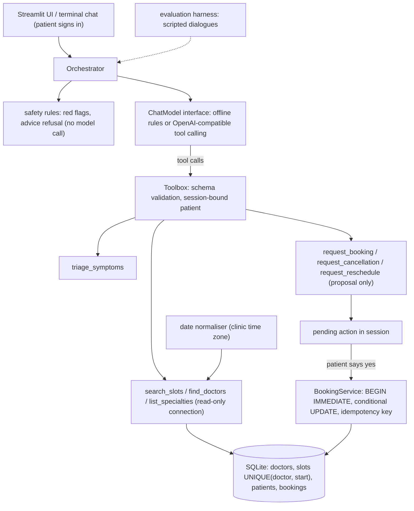

# clinicdesk-agent

An agentic clinic front desk that triages symptoms to a specialty, finds free slots and books, cancels or moves appointments. The language model only *proposes* actions through typed tools; every booking rule is enforced in code.

> **Status:** working v0.1. The scheduling service, safety layer, tool-calling orchestrator, offline demo model, evaluation harness, CLI and Streamlit UI are implemented and tested. See the [roadmap](#roadmap).

## Features

- **Symptom triage to a specialty**, with transparent keyword rules and a "not medical advice" disclaimer on every triage reply.
- **Emergency red-flag screening** (chest pain, breathing trouble, stroke signs, heavy bleeding, seizures, anaphylaxis, self-harm, overdose) runs *before* the model and tells the patient to call emergency services.
- **Refuses diagnosis, prescriptions and dosing questions** with a fixed message.
- **Slot search** by specialty, doctor, natural-language date ("tomorrow", "next Friday", "Oct 14", "next week") and part of day.
- **Booking, cancellation and rescheduling** through a transactional scheduling service: no double booking, only published slots, nothing in the past, an explicit confirmation step.
- **Two model back ends behind one interface:** an offline rule-based model (no API key, used for the demo and as an evaluation baseline) and any OpenAI-compatible chat API with native tool calling.
- **Scripted-dialogue evaluation** measuring routing accuracy, reply type, booking outcomes and database invariants.
- **CLI** (`clinicdesk init-db | chat | eval | ui`) and a **Streamlit** chat UI with sign-in and confirm/decline buttons.

## Architecture



## Quickstart

```bash
python -m venv .venv && . .venv/Scripts/activate     # Windows; use .venv/bin/activate on Linux/macOS
pip install -e ".[dev]"                             # core has no third-party dependencies
cp .env.example .env                                # optional; fill in only what you need
clinicdesk init-db                                  # synthetic doctors and slots for the next 14 days
clinicdesk chat --handle patient-a --register       # asks for a passcode, then chat in the terminal
```

Example conversation with the offline model:

```text
you> I have heartburn and bloating, can I come in this week?
desk> Here are the earliest free slots:
      - Slot 244: Dr. Kendall Mensah (Gastroenterology), Wed 07 Oct 2026, 10:00
      ...
      This is not medical advice or a diagnosis. ...
you> book the first one
desk> I've prepared that change; nothing is final until you confirm.
      Please confirm: Book Dr. Kendall Mensah (Gastroenterology) on Wed 07 Oct 2026, 10:00 [slot 244]. ...
you> yes
desk> Booked: Dr. Kendall Mensah (Gastroenterology) on Wed 07 Oct 2026, 10:00. Booking number 227.
```

Other entry points:

```bash
pip install -e ".[ui]" && clinicdesk ui             # Streamlit app
pip install -e ".[openai]"                          # then set CLINICDESK_LLM_PROVIDER=openai and OPENAI_API_KEY
clinicdesk eval --json eval_summary.json            # scripted-dialogue evaluation with the configured model
```

To use a local OpenAI-compatible server (for example Ollama or vLLM), set `CLINICDESK_LLM_PROVIDER=openai`, `CLINICDESK_LLM_BASE_URL` and `CLINICDESK_LLM_MODEL`; no API key is needed then.

## Configuration

All settings are environment variables (a local `.env` is loaded when `python-dotenv` is installed, via the `[env]` extra).

| Variable | Default | Meaning |
|---|---|---|
| `CLINICDESK_DB_PATH` | `~/.clinicdesk/clinicdesk.db` | SQLite file; resolved to an absolute path |
| `CLINICDESK_TIMEZONE` | `UTC` | Clinic time zone (IANA name) used for "today" and "tomorrow" |
| `CLINICDESK_LLM_PROVIDER` | `offline` | `offline` (rule-based, no network) or `openai` |
| `CLINICDESK_LLM_MODEL` | `gpt-4o-mini` | Model name for the OpenAI-compatible provider |
| `CLINICDESK_LLM_BASE_URL` | unset | Base URL of an OpenAI-compatible server |
| `OPENAI_API_KEY` | unset | API key for the `openai` provider (never logged or shown in `repr`) |
| `CLINICDESK_MAX_TOOL_STEPS` | `4` | Upper bound on model/tool round trips per message |
| `CLINICDESK_MAX_ACTIVE_BOOKINGS` | `3` | Upcoming appointments one patient may hold |
| `CLINICDESK_EMERGENCY_NUMBER` | `911` | Number shown in emergency messages |
| `CLINICDESK_SEED` | `7` | Seed for `clinicdesk init-db` |
| `CLINICDESK_SEED_DAYS` | `14` | Days of availability generated, starting tomorrow |

## Project structure

```
src/clinicdesk_agent/
  config.py              settings from environment variables
  dates.py               relative-date and time normalisation
  app.py                 composition root (settings -> services -> orchestrator)
  cli.py                 `clinicdesk` command
  db/schema.sql          tables, UNIQUE and partial-unique constraints
  db/connection.py       read-only and read-write connections, BEGIN IMMEDIATE transactions
  db/seed.py             seeded synthetic data relative to today
  scheduling/slots.py    read-only search queries
  scheduling/booking.py  book / cancel / reschedule, invariant checks
  scheduling/patients.py patient handles with scrypt-hashed passcodes
  safety/triage.py       red flags, advice refusal, specialty suggestion
  safety/disclaimers.py  all user-facing safety text
  agent/llm.py           ChatModel interface, ToolCall, scripted fake
  agent/tools.py         tool schemas, argument validation, Toolbox, Session
  agent/orchestrator.py  conversation loop and confirmation step
  agent/offline.py       rule-based model for the offline demo
  agent/openai_adapter.py OpenAI-compatible tool-calling adapter
  agent/prompts.py       system prompt
  evaluation/            dialogues.json and the evaluation harness
  ui/streamlit_app.py    Streamlit chat UI
tests/                   pytest suite (no network, no API keys)
.github/workflows/ci.yml GitHub Actions: tests + offline evaluation
```

## How it works

1. **Sign-in.** A patient is a handle plus a salted scrypt hash of a passcode. The resulting `patient_id` is stored in the session; no tool accepts a patient id.
2. **Safety first.** Every message is screened for emergency red flags and for diagnosis/prescription requests. Matches get a fixed reply and the model is not called.
3. **Tool calling.** The model sees the conversation and eight tool schemas. Each call is validated (types, ranges, enums, length, *no unknown keys*) before the handler runs. Errors go back to the model as structured results, so it can recover instead of crashing the UI.
4. **Dates.** The model passes the patient's words ("next Friday") to `search_slots`; the tool resolves them in the clinic time zone and reports the resolved range. Invalid dates are rejected, never sent to SQL.
5. **Proposal, then confirmation.** `request_booking` only checks the slot and stores a pending action. The orchestrator appends a canonical "Please confirm" line. Only an explicit "yes" (or the Confirm button) calls `BookingService.book`. Any other message drops the proposal, so a stale "yes" cannot book something later.
6. **Atomic writes.** `book` runs in `BEGIN IMMEDIATE`, claims the slot with `UPDATE slots SET is_booked = 1 WHERE slot_id = ? AND is_booked = 0`, and inserts the booking with an idempotency key. Reschedule claims the new slot and releases the old one in the same transaction.

## Security design

What is enforced in code, not left to the prompt:

| Concern | Enforcement |
|---|---|
| Double booking | Conditional `UPDATE ... WHERE is_booked = 0` inside `BEGIN IMMEDIATE`, plus a partial `UNIQUE` index allowing one active booking per slot; a threaded race test checks exactly one winner |
| Booking outside availability | Bookings reference an existing `slot_id`; there is no code path that creates slots on demand; past slots are rejected |
| LLM database access | The model never writes SQL. Read tools use a `mode=ro` + `PRAGMA query_only` connection; writes happen only in `BookingService` after patient confirmation |
| Patient privacy | Tools take no `patient_id`; the session supplies it. Search results contain no patient data; bookings are returned only to their owner, and another patient's booking id looks "not found" |
| Data minimisation | The schema stores a handle and a passcode hash only: no names, dates of birth, contact details or symptoms. Chat history lives in memory and is trimmed |
| Credentials | Passcodes are salted scrypt hashes compared in constant time; the API key comes from the environment and is excluded from `repr`; `.env` and `*.db` are git-ignored |
| Prompt injection | Tool schemas reject unknown arguments, string arguments are length-limited, and the system prompt marks tool output as data. Even a fully compromised model can only propose actions for the signed-in patient |
| Runaway agents | At most `CLINICDESK_MAX_TOOL_STEPS` model calls per message and a per-patient cap on upcoming bookings |
| Medical safety | Red-flag screening before the model and again inside the triage tool; fixed refusal for diagnosis/prescription/dose requests; disclaimer appended to every triage reply |

## Testing

```bash
pip install -e ".[dev]"
pytest -q            # 97 tests, about 20 s, no network or API keys
clinicdesk eval      # 15 scripted dialogues against the offline model
```

The tests cover booking races and constraints, date resolution, read-only enforcement, tool-argument validation, the orchestrator loop with scripted fake models (multi-step calls, malformed JSON, unknown tools, model outages, step limits, confirmation and stale confirmation), the safety rules, seeding, configuration, the OpenAI adapter (with a fake client) and the evaluation harness. CI (`.github/workflows/ci.yml`) runs both on every push (Python 3.11).

Current offline-model evaluation: 15/15 dialogues, routing accuracy 1.0, booking-outcome accuracy 1.0, 0 invariant violations. These dialogues were written alongside the rule-based model, so treat that score as a regression baseline rather than a quality claim; the harness is meant for comparing hosted models.

## Roadmap

- [x] **M1:** schema and scheduling service with transactional booking and tests
- [x] **M2:** typed tools and a tool-calling orchestrator (offline and OpenAI-compatible models)
- [x] **M3:** date normalisation and a confirmation step
- [x] **M4:** safety layer (red flags, refusals, disclaimers)
- [x] **M5:** scripted-dialogue evaluation harness
- [x] **M6:** Streamlit UI with patient sign-in
- [ ] Larger, independently written dialogue set and a comparison of hosted models
- [ ] Clinic-staff view (manage availability, see the day's schedule) with role-based access
- [ ] Postgres back end with row-level locking for multi-instance deployment
- [ ] Rate limiting and lockout after repeated failed sign-ins
- [ ] Multilingual red-flag rules

## Limitations and responsible use

- **This is not a medical device and does not give medical advice.** Triage only suggests which kind of clinician to book; keyword rules can miss or misread symptoms. Red-flag detection is a safety net, not a guarantee, and is English-only.
- The demo data is synthetic: generated doctor names and handles such as `demo-patient-a`. Do not load real patient data into the demo database.
- The sign-in is deliberately minimal (handle + passcode). A real deployment needs proper identity verification, TLS, audit logging, rate limiting and compliance review (for example HIPAA or GDPR, depending on where it runs).
- When a hosted model is used, conversation text, including any symptoms a patient types, is sent to that provider. Use a local OpenAI-compatible server if that is not acceptable.

## License

[MIT](LICENSE) © 2026 Krishna Annavaram
