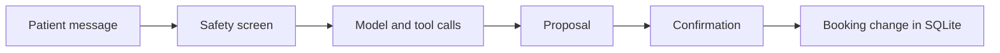
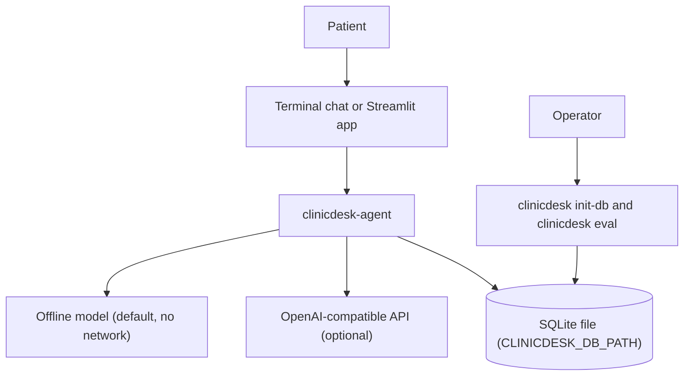
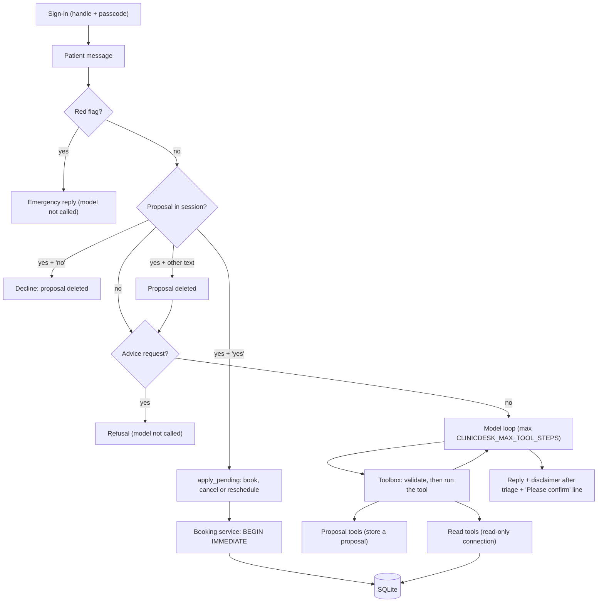

<div align="center">

# clinicdesk-agent — Clinic Front Desk Assistant

**clinicdesk-agent is an assistant with typed tools for the front desk of a small outpatient clinic. It takes a patient message through these steps to a confirmed booking change:**

`sign-in` → `safety screen` → `model and tool calls` → `proposal` → `confirmation` → `atomic write`.


**[Summary](#1-summary)** ·
**[Workflow](#4-the-end-to-end-workflow)** ·
**[Run it](#16-how-to-run-clinicdesk-agent)** ·
**[Configuration](#164-environment-variables)** ·
**[Known problems](#19-known-problems)** ·
**[Glossary](#21-glossary)**

</div>

> [!NOTE]
> This README uses ASD-STE100 Simplified Technical English. The writing rules and the project
> vocabulary are in [`docs/ste-style-guide.md`](docs/ste-style-guide.md). Each term in the
> [Glossary](#21-glossary) has only one meaning.

---

clinicdesk-agent helps a patient find a specialty, find a free slot, and book, cancel or reschedule a booking. The main idea is simple: the model only proposes. It calls eight typed tools, and the code enforces each booking rule. A change to the database occurs only after an explicit confirmation from the patient. An offline model with no network and no key runs the same code paths as a hosted model.

This README is the **one location that explains all of clinicdesk-agent**. It gives these topics:

- the general design
- each component and its procedure, step by step
- the safety model and the decision rules
- the data map
- the runbook
- the validation results and the known problems

| If you are… | Read |
|---|---|
| A manager or reviewer | [1](#1-summary), [3](#3-design-rules), [4](#4-the-end-to-end-workflow), [18](#18-validation-results), [20](#20-key-points) |
| A developer who joins the project | All sections, in sequence. Keep [16](#16-how-to-run-clinicdesk-agent) and [19](#19-known-problems) open while you work |
| An operator who runs clinicdesk-agent | [16](#16-how-to-run-clinicdesk-agent), [14](#14-the-safety-model), then the section for the component that you use |

---

## Table of contents

1. 🧭 [Summary](#1-summary)
2. 🏗️ [How clinicdesk-agent is built](#2-how-clinicdesk-agent-is-built)
   - 2.1 [Components](#21-components)
   - 2.2 [System context](#22-system-context)
   - 2.3 [Repository layout](#23-repository-layout)
3. 🛡️ [Design rules](#3-design-rules)
4. 🔄 [The end-to-end workflow](#4-the-end-to-end-workflow)
   - 4.1 [Full flow](#41-full-flow)
   - 4.2 [The life cycle of one message](#42-the-life-cycle-of-one-message)
5. 🔵 [Patient sign-in](#5-patient-sign-in)
6. 🟢 [The safety screen](#6-the-safety-screen)
7. 🟣 [The orchestrator](#7-the-orchestrator)
8. 🟠 [The models](#8-the-models)
9. 🟡 [The toolbox and the eight tools](#9-the-toolbox-and-the-eight-tools)
10. 🔷 [The date resolver](#10-the-date-resolver)
11. 🟤 [The booking service and the database](#11-the-booking-service-and-the-database)
12. 🧪 [The evaluation harness](#12-the-evaluation-harness)
13. 🖥️ [The user interfaces](#13-the-user-interfaces)
    - 13.1 [The command line](#131-the-command-line) · 13.2 [The Streamlit app](#132-the-streamlit-app)
14. ⚖️ [The safety model](#14-the-safety-model)
15. 🗂️ [Data and file map](#15-data-and-file-map)
16. ▶️ [How to run clinicdesk-agent](#16-how-to-run-clinicdesk-agent)
    - 16.1 [Prerequisites](#161-prerequisites) · 16.2 [Installation](#162-installation) · 16.3 [Run clinicdesk-agent](#163-run-clinicdesk-agent) · 16.4 [Environment variables](#164-environment-variables)
17. 🧩 [How to extend clinicdesk-agent](#17-how-to-extend-clinicdesk-agent)
18. ✅ [Validation results](#18-validation-results)
19. ⚠️ [Known problems](#19-known-problems)
20. 📌 [Key points](#20-key-points)
21. 📖 [Glossary](#21-glossary)
22. 📄 [License](#22-license)

---

## 1. Summary

**The problem.** A chat model at a clinic front desk can invent slots, book for the wrong person or give medical advice. These are the difficult questions:

- How do you stop a model that books a slot that does not exist, or a slot that another patient holds?
- How do you make sure that a patient sees and changes only the bookings of that patient?
- How do you stop a booking that the patient did not ask for?
- How do you send an emergency to emergency services before the model can reply?
- How do you measure a model before you trust it?

clinicdesk-agent gives each of these questions its own component in code. The prompt gives guidance only, and no rule depends on it.

| Item | Value |
|---|---|
| Input | A message from a signed-in patient (terminal or Streamlit) |
| Output | A reply with a reply kind, and, after confirmation, one booking change in SQLite |
| Components | **9**: patient registry, safety screen, orchestrator, models, toolbox, date resolver, booking service, evaluation harness, user interfaces |
| Tools | **8**: `triage_symptoms`, `list_specialties`, `find_doctors`, `search_slots`, `request_booking`, `list_my_appointments`, `request_cancellation`, `request_reschedule` |
| Providers | `offline` (default, rule-based) or `openai` (any OpenAI-compatible chat API, remote or local). Both are optional |
| Offline mode | All commands, all tools and the evaluation run with no key and no network |
| Safety | Red-flag screen before the model, no `patient_id` argument in any tool, read-only connections for read tools, confirmation before each write |
| Dependencies | Core: standard library only (`tzdata` on Windows). Extras: `openai`, `ui`, `env`, `dev`, `all` |
| Tests | **102** unit tests (`pytest`), no network, no API key |



---

## 2. How clinicdesk-agent is built

### 2.1 Components

| Component | Module | Purpose |
|---|---|---|
| Settings | `src/clinicdesk_agent/config.py` | Read and validate the environment variables |
| Composition root | `src/clinicdesk_agent/app.py` | Connect settings, database, services, model and orchestrator |
| Patient registry | `src/clinicdesk_agent/scheduling/patients.py` | Register patients and check each sign-in with scrypt passcode hashes |
| Safety screen | `src/clinicdesk_agent/safety/triage.py`, `safety/disclaimers.py` | Red flags, advice requests, specialty triage, fixed safety text |
| Orchestrator | `src/clinicdesk_agent/agent/orchestrator.py` | Safety screen, confirmation step, model loop with a step limit |
| Models | `src/clinicdesk_agent/agent/llm.py`, `agent/offline.py`, `agent/openai_adapter.py` | One `ChatModel` interface, the offline model, the OpenAI-compatible adapter |
| System prompt | `src/clinicdesk_agent/agent/prompts.py` | Guidance text for a hosted model |
| Toolbox | `src/clinicdesk_agent/agent/tools.py` | Tool schemas, argument validation, tool handlers, session and proposal |
| Date resolver | `src/clinicdesk_agent/dates.py` | Resolve date phrases and part of day in clinic time |
| Booking service | `src/clinicdesk_agent/scheduling/booking.py`, `scheduling/slots.py` | Transactional book, cancel and reschedule. Read-only slot queries |
| Database | `src/clinicdesk_agent/db/schema.sql`, `db/connection.py`, `db/seed.py` | Schema, read-only and read-write connections, demo data |
| Evaluation harness | `src/clinicdesk_agent/evaluation/harness.py`, `evaluation/dialogues.json` | Run 15 scripted dialogues and give a score |
| User interfaces | `src/clinicdesk_agent/cli.py`, `ui/streamlit_app.py` | The `clinicdesk` command and the Streamlit chat app |

### 2.2 System context



### 2.3 Repository layout

```
clinicdesk-agent/
├── .github/workflows/ci.yml        CI: pytest, then `clinicdesk eval` (Python 3.11)
├── .env.example                    names of all environment variables, no values
├── docs/ste-style-guide.md         writing rules and project vocabulary
├── pyproject.toml                  package, extras, `clinicdesk` entry point, pytest settings
├── src/clinicdesk_agent/
│   ├── app.py                      composition root
│   ├── cli.py                      `clinicdesk` command: init-db, chat, eval, ui
│   ├── config.py                   settings from environment variables
│   ├── dates.py                    date phrases, part of day, clock times
│   ├── agent/                      llm.py, offline.py, openai_adapter.py, orchestrator.py, prompts.py, tools.py
│   ├── db/                         schema.sql, connection.py, seed.py
│   ├── evaluation/                 dialogues.json, harness.py
│   ├── safety/                     triage.py, disclaimers.py
│   ├── scheduling/                 booking.py, slots.py, patients.py, models.py, errors.py
│   └── ui/streamlit_app.py         Streamlit chat app
└── tests/                          102 pytest tests in 9 files, no network, no API key
```

---

## 3. Design rules

### 3.1 The model proposes and the code decides
The model can only call the eight tools in `TOOL_SPECS`. The three proposal tools store a proposal and write nothing. Only `Toolbox.apply_pending` writes, and only the orchestrator calls it after a confirmation. The model cannot call `apply_pending`.

### 3.2 The patient identity comes from sign-in, not from the model
No tool has a `patient_id` argument. The toolbox takes the patient from the `Session`, which `PatientRegistry` makes at sign-in. The argument validation rejects each unknown key, so an injected `patient_id` gives `invalid_arguments`.

### 3.3 The safety screen runs before the model
The orchestrator compares each message with the red-flag patterns and the advice patterns before it calls the model. If a pattern matches, the reply is fixed text and the model does not run. The `triage_symptoms` tool does the red-flag check again on its own argument.

### 3.4 Read tools cannot write
Read tools get a connection that opens the file with `mode=ro` and sets `PRAGMA query_only = ON`. The slot queries in `scheduling/slots.py` never select from `patients` or `bookings`. A test tries a write on this connection and expects an error.

### 3.5 Each write is atomic and conditional
The booking service runs each write in `BEGIN IMMEDIATE`. It claims a slot with `UPDATE slots SET is_booked = 1 ... WHERE slot_id = ? AND is_booked = 0`. A partial `UNIQUE` index permits only one active booking for each slot. A reschedule claims the new slot and releases the old slot in the same transaction.

### 3.6 Each failure becomes a structured result
A bad tool name, bad JSON, a bad argument or a `SchedulingError` returns to the model as `{"ok": false, "error": <code>}`. A model failure or a step-limit stop gives a fixed reply that says "Nothing was booked or changed." No exception reaches the user interface.

### 3.7 Store the minimum data
The schema stores a handle, a scrypt passcode hash and a creation time for each patient. It stores no name, no date of birth, no contact data and no symptoms. The conversation history stays in memory only.

---

## 4. The end-to-end workflow

### 4.1 Full flow



### 4.2 The life cycle of one message

1. The patient completes the sign-in. The session gets the `patient_id` from the `patients` table.
2. The patient sends a message. The orchestrator removes outer spaces and keeps the first 2000 characters.
3. The orchestrator screens the message for red flags. If one matches, it deletes the proposal and gives the emergency reply.
4. If the session has a proposal and the message is "yes", the orchestrator applies the proposal.
5. If the session has a proposal and the message is "no", the orchestrator deletes the proposal.
6. If the message is a different text, the orchestrator deletes the proposal and continues.
7. The orchestrator screens the message for an advice request. If one matches, it gives the refusal.
8. The orchestrator adds the message to the history and calls the model with the system prompt and eight tool schemas.
9. For each tool call, the toolbox validates the arguments, runs the tool and adds the tool result to the history.
10. The loop stops when the model sends text with no tool call, or when it reaches the step limit.
11. If `triage_symptoms` ran, the orchestrator adds the disclaimer to the reply.
12. If a proposal exists, the orchestrator adds a "Please confirm" line and sets the reply kind to `confirm`.
13. The patient replies "yes". The booking service writes the change and the reply kind is `done`.

---

## 5. Patient sign-in

**Purpose.** Identify the patient before the conversation starts, with the minimum data.

| Input | Output |
|---|---|
| A handle and a passcode | A `Patient` (`patient_id`, `handle`) and a new `Session`, or an `AuthError` |

**Procedure**

1. `normalise_handle` removes outer spaces and changes the handle to lowercase.
2. The handle must match `[a-z0-9][a-z0-9._-]{2,31}`, that is 3 to 32 characters.
3. To register, the passcode must have a minimum of 6 characters.
4. `register` rejects a handle that is already in the `patients` table.
5. `hash_passcode` makes a scrypt hash with a random 16-byte salt (N = 16384, r = 8, p = 1, 32-byte digest).
6. `register` stores `scrypt$N$r$p$salt$digest` in `passcode_hash`.
7. `authenticate` calculates the scrypt hash again and compares it with `hmac.compare_digest`.
8. The interface makes `Session(patient_id, handle)`. No later step changes the `patient_id`.

**Rules**

- A bad handle and a bad passcode give the same error text: "invalid handle or passcode".
- The patient registry does not limit the number of failed sign-ins. See [Known problems](#19-known-problems).

---

## 6. The safety screen

**Purpose.** Stop emergencies and advice requests before the model, and suggest a specialty with clear keyword rules.

| Input | Output |
|---|---|
| The message text (or the `symptoms` argument of `triage_symptoms`) | A `RedFlag`, an advice-request flag, or a `TriageSuggestion` |

**Procedure**

1. `screen_for_emergency` compares the text with nine red-flag patterns, in sequence. The first match wins.
2. `is_medical_advice_request` compares the text with the advice patterns.
3. `suggest_specialty` finds the keywords of each specialty in the text, at the start of a word.
4. If no keyword matches, triage gives `Family Medicine` with `confident = false`.
5. If a child keyword matches ("my son", "toddler" and more), triage gives `Pediatrics`.
6. Else, the specialty with the most keyword matches wins. The other matches become `alternatives`.
7. `match_specialty_name` finds a specialty that the patient names, for example "cardiologist" or "a GP".

**The nine red flags**

| Code | Reason in the emergency reply | Example patterns |
|---|---|---|
| `chest_pain` | chest pain or pressure | "chest pain", "heart attack", "crushing pain" |
| `breathing` | severe difficulty breathing | "can't breathe", "shortness of breath", "lips turning blue" |
| `stroke` | possible stroke signs | "slurred speech", "face droop", "stroke", "suddenly numb" |
| `bleeding` | heavy bleeding | "won't stop bleeding", "coughing up blood", "vomiting blood" |
| `consciousness` | loss of consciousness or seizure | "passed out", "fainted", "seizure", "unresponsive" |
| `anaphylaxis` | possible severe allergic reaction | "anaphylaxis", "throat closing", "swollen tongue" |
| `self_harm` | thoughts of suicide or self-harm | "suicidal", "kill myself", "hurt myself" |
| `overdose` | possible overdose or poisoning | "overdose", "took too many pills", "swallowed bleach" |
| `head_injury` | serious head injury | "hit my head ... vomit", "worst headache of my life", "thunderclap headache" |

**The ten specialties**

`Cardiology`, `Dermatology`, `Family Medicine`, `Gastroenterology`, `General Surgery`, `Gynecology`, `Neurology`, `Orthopedics`, `Pediatrics`, `Psychiatry`.

**Rules**

- The emergency reply tells the patient to call `CLINICDESK_EMERGENCY_NUMBER` (default `911`) or the local emergency number.
- All safety text is in `safety/disclaimers.py`: `TRIAGE_DISCLAIMER`, `ADVICE_REFUSAL` and `emergency_message`.
- The rules are English regular expressions. They do not understand negation or past events.

---

## 7. The orchestrator

**Purpose.** Run the fixed order of checks for each message and keep the model inside a step limit.

| Input | Output |
|---|---|
| A `Session` and one message | A `Reply` with `text`, `kind`, `tools_called` and, after a confirmation, `result` |

**Procedure**

1. `handle` cuts the message to 2000 characters. An empty message gives "Please type a message."
2. `handle` runs the red-flag screen, then the proposal check, then the advice check (see [4.2](#42-the-life-cycle-of-one-message)).
3. `_run_model` builds the system prompt with the clinic time, the time zone and the handle.
4. `_run_model` calls `model.complete` with the system prompt, the history and the eight schemas.
5. If the model raises `LLMError`, the orchestrator deletes the proposal and gives the `UNAVAILABLE` reply.
6. If `triage_symptoms` gives an emergency result, the loop stops and the reply is the emergency reply.
7. If the loop reaches the step limit, the orchestrator deletes the proposal and gives the `TOO_MANY_STEPS` reply.
8. `_remember` adds the reply to the history. `_trim` keeps the last 24 messages and cuts only at a patient message.

**Confirmation words**

| Result | The message starts with |
|---|---|
| Confirm | `yes`, `y`, `yeah`, `yep`, `sure`, `confirm`, `confirmed`, `ok`, `okay`, `please do`, `go ahead`, `do it`, `book it` |
| Decline | `no`, `n`, `nope`, `don't`, `do not`, `stop`, `never mind`, `nevermind`, `not now` |

**Rules**

- A deny word always wins over a confirm word.
- A proposal lives for one message only. A different message deletes it, so an old "yes" cannot book later.
- `confirm` and `decline` are public methods. The Streamlit buttons call them directly.

---

## 8. The models

**Purpose.** Give one `ChatModel` interface to the orchestrator, with an offline model and a hosted model behind it.

| Input | Output |
|---|---|
| A list of neutral messages and the tool schemas | An `AssistantTurn` with text, tool calls or both |

**The three model classes**

| Class | Module | Use |
|---|---|---|
| `RuleBasedChatModel` | `agent/offline.py` | Default. Offline demo and evaluation baseline. No network |
| `OpenAIChatModel` | `agent/openai_adapter.py` | Any OpenAI-compatible chat-completions API with native tool calls |
| `ScriptedChatModel` | `agent/llm.py` | Test double that gives pre-written turns and records each call |

**Procedure of the offline model**

1. If the last messages are tool results, it composes a reply from them, or chains `triage_symptoms` to `search_slots`.
2. It answers a greeting or "help" with the help text.
3. It maps "my appointments" to `list_my_appointments`.
4. It maps "move 12 to slot 40" to `request_reschedule` and "cancel 12" to `request_cancellation`.
5. It maps "book slot 7" or "book the first one" to `request_booking`. An ordinal uses the last search result.
6. It maps "which specialties" to `list_specialties` and "which doctors" to `find_doctors`.
7. It maps symptom words to `triage_symptoms`, unless the message names a specialty or a doctor.
8. It maps search words, a specialty, a doctor or a date phrase to `search_slots`.

**Procedure of the hosted model**

1. `build_model` makes `OpenAIChatModel` when `CLINICDESK_LLM_PROVIDER=openai`.
2. The adapter changes each neutral message to the OpenAI wire format.
3. It calls `chat.completions.create` with `temperature=0` and a 30-second timeout.
4. It parses each tool-call argument string as JSON. Bad JSON becomes `arguments = None`.
5. Each exception becomes `LLMError` with the exception class name only.

**Rules**

- The API key comes from `OPENAI_API_KEY`. `Settings` excludes it from `repr`.
- For a local server, the adapter sends the placeholder key `not-needed-for-local-servers`.
- The system prompt is guidance only. It tells the model to treat tool results as data.

---

## 9. The toolbox and the eight tools

**Purpose.** Validate each tool call against its schema and run the tool for the signed-in patient only.

| Input | Output |
|---|---|
| A `Session` and a `ToolCall` | A JSON tool result with `"ok": true` or `"ok": false` and an `error` code |

**The eight tools**

| Tool | Kind | Arguments | Result |
|---|---|---|---|
| `triage_symptoms` | Read | `symptoms` (required) | Suggested specialty, matched keywords, alternatives, disclaimer, or an emergency |
| `list_specialties` | Read | none | The specialties in the `doctors` table |
| `find_doctors` | Read | `specialty`, `doctor_name` | Doctor names and specialties (no ids) |
| `search_slots` | Read | `specialty`, `doctor_name`, `date`, `part_of_day`, `limit` (1 to 20, default 8) | Free future slots, earliest first, and `resolved_dates` |
| `list_my_appointments` | Read | none | The upcoming bookings of the signed-in patient |
| `request_booking` | Proposal | `slot_id` (required, minimum 1) | `awaiting_confirmation` and a summary |
| `request_cancellation` | Proposal | `booking_id` (required, minimum 1) | `awaiting_confirmation` and a summary |
| `request_reschedule` | Proposal | `booking_id`, `new_slot_id` (both required) | `awaiting_confirmation` and a summary |

**Procedure**

1. `execute` finds the tool spec. An unknown name gives `unknown_tool` and the list of tool names.
2. `validate_arguments` rejects bad JSON, a non-object value and each unknown key.
3. It changes an integer argument with `int()`, rejects a boolean and checks the minimum and the maximum.
4. It removes outer spaces from a string, rejects a string longer than 300 characters and checks the enum.
5. The handler runs. A `SchedulingError` becomes a result with its stable `code`.
6. A proposal tool checks that the slot exists, is in the future and is free, or that the booking is the patient's own.
7. A proposal tool stores one `PendingAction` with a new idempotency key in the session.

**Error codes**

| Code | Cause |
|---|---|
| `unknown_tool` | The model called a tool that does not exist |
| `invalid_arguments` | Bad JSON, an unknown key, a wrong type or a value out of range |
| `invalid_date` | The date resolver cannot resolve the date phrase |
| `unknown_specialty` | The specialty is not in the `doctors` table (the result lists the specialties) |
| `doctor_not_found` | No doctor name contains the given text |
| `slot_not_found` | The slot id does not exist |
| `slot_unavailable` | The slot has an active booking |
| `slot_in_past` | The slot start time is not after the clock time |
| `booking_not_found` | No upcoming booking of this patient has this id |
| `booking_limit_reached` | The patient has `CLINICDESK_MAX_ACTIVE_BOOKINGS` upcoming bookings |
| `patient_time_conflict` | The patient has an active booking at the same start time |
| `idempotency_conflict` | The idempotency key belongs to a different patient or slot |
| `nothing_pending` | A confirmation arrived with no proposal in the session |

**Rules**

- A booking of a different patient gives `booking_not_found`. Nobody can find the ids of other bookings this way.
- `search_slots` results contain no patient data, only slot, doctor, specialty, time and duration.

---

## 10. The date resolver

**Purpose.** Change the date phrase of a patient into a fixed date range in clinic time, or reject it.

| Input | Output |
|---|---|
| A date phrase and today's date in clinic time | A `DateRange` (start and end, both inclusive), or `DateParseError` |

**Accepted date phrases**

| Phrase | Result |
|---|---|
| `YYYY-MM-DD` | That day. An invalid date, for example `2026-02-30`, is rejected |
| `today`, `tomorrow`, `tmrw`, `day after tomorrow` | One day |
| `this week` | Today to Sunday |
| `next week` | Monday to Sunday of the next week |
| `this weekend`, `next weekend` | The next Saturday and Sunday, or the pair 7 days later |
| `in N days` | One day, N = 1 or 2 digits |
| `friday`, `on friday`, `this friday` | The first Friday from today, today included |
| `next friday` | The first Friday after today, today excluded |
| `oct 14`, `14th of october` | The next date with that month and day, today included |

**Parts of day**

| Part of day | Start time filter |
|---|---|
| `morning` | 06:00 to before 12:00 |
| `afternoon` | 12:00 to before 17:00 |
| `evening` | 17:00 to before 21:00 |

**Rules**

- The tool resolves the phrase, not the model. `search_slots` gives the result back as `resolved_dates`.
- An unknown phrase never goes to SQL. The tool gives `invalid_date`.
- In free text, the offline model ignores `sun` and `sat` as weekday names, because they are also common words.

---

## 11. The booking service and the database

**Purpose.** Apply each booking change in one transaction and keep the database rules true.

| Input | Output |
|---|---|
| A `patient_id` from the session and a slot id or a booking id | A `Booking`, or a typed `SchedulingError` |

**Procedure of `book`**

1. Open a write connection and start `BEGIN IMMEDIATE`.
2. If the idempotency key exists, return that booking. A key for a different patient or slot gives `idempotency_conflict`.
3. Count the upcoming active bookings of the patient. At the limit, raise `booking_limit_reached`.
4. Check that the slot exists and starts after the clock time.
5. Check that the patient has no other active booking at the same start time.
6. Claim the slot with the conditional `UPDATE`. If no row changes, raise `slot_unavailable`.
7. Insert the booking with the status `active` and the idempotency key, then `COMMIT`.

**Procedure of `cancel` and `reschedule`**

1. Find the active booking with this `booking_id` and this `patient_id`. Else, raise `booking_not_found`.
2. Reject a booking that has started (`slot_in_past`).
3. For `cancel`, set the status to `cancelled`, set `cancelled_at` and release the slot.
4. For `reschedule`, claim the new slot first, then cancel the old booking and release its slot.
5. For `reschedule`, insert a new active booking. The new booking has a new `booking_id`.

**Database tables**

| Table | Columns | Rules in the schema |
|---|---|---|
| `doctors` | `doctor_id`, `name`, `specialty` | `name` is `UNIQUE` |
| `slots` | `slot_id`, `doctor_id`, `start_at`, `duration_min`, `is_booked`, `version` | `UNIQUE (doctor_id, start_at)`, `duration_min` 5 to 240, `is_booked` 0 or 1 |
| `patients` | `patient_id`, `handle`, `passcode_hash`, `created_at` | `handle` is `UNIQUE` |
| `bookings` | `booking_id`, `slot_id`, `patient_id`, `status`, `idempotency_key`, `created_at`, `cancelled_at` | `status` is `active` or `cancelled`, `idempotency_key` is `UNIQUE`, foreign keys |
| index `ux_bookings_one_active_per_slot` | `bookings (slot_id) WHERE status = 'active'` | One active booking for each slot |

**Rules**

- Times are clinic-time strings `YYYY-MM-DDTHH:MM` with no offset.
- Each connection sets `PRAGMA foreign_keys = ON` and a busy timeout of 10 000 ms. The database uses WAL mode.
- No code path makes a slot on request. Only `seed_database` writes slots.
- `check_invariants` finds three problems: two active bookings for one slot, an `is_booked` flag that disagrees with the bookings, and duplicate doctor slots.

**Demo data (`clinicdesk init-db`)**

1. Delete all rows from `bookings`, `slots`, `patients` and `doctors`.
2. Write two doctors for each of the ten specialties, with synthetic names from the seed.
3. Write five demo patients, `demo-patient-a` to `demo-patient-e`, with random passcodes that nobody sees.
4. For each doctor and each day from tomorrow, skip Sunday and select morning, afternoon or both.
5. Write 2 to 5 slots of 30 minutes for each doctor and day. Mark about 25% as booked by demo patients.

---

## 12. The evaluation harness

**Purpose.** Give a repeatable score for a model on scripted dialogues, with the database rules checked after each dialogue.

| Input | Output |
|---|---|
| A model factory and `dialogues.json` (15 dialogues) | A summary with pass count, three accuracy values and the invariant violations |

**Procedure**

1. Make a temporary directory. For each dialogue, make a new SQLite file in it.
2. Seed the file with seed 7 for 10 days from Monday 2026-01-05. Fix the clock at 08:00.
3. Register each handle of the dialogue (default `eval-a`) with a synthetic passcode.
4. Send each turn to the orchestrator. Fill the `{first_listed_slot}`, `{last_booking_id}` and `{last_booked_slot}` placeholders.
5. Compare `expect_tools`, `expect_kind` and `expect_text` with the reply.
6. Compare `expect_active_bookings` with the upcoming bookings of each handle.
7. Run `check_invariants`. A dialogue passes only with no failure and no violation.

**Summary fields**

| Field | Meaning |
|---|---|
| `dialogues_passed` | Passed dialogues / all dialogues |
| `routing_accuracy` | Turns with the expected tool list / turns with `expect_tools` |
| `reply_type_accuracy` | Turns with the expected reply kind / turns with `expect_kind` |
| `booking_outcome_accuracy` | Correct booking counts / booking checks |
| `invariant_violations` | Number of invariant problems in all dialogues |
| `failures` | One text line for each failure |

**Rules**

- `clinicdesk eval` gives exit code 0 only if all dialogues pass with no invariant violation. Else it gives 1.
- `clinicdesk eval` uses the configured provider. With `openai`, it scores the hosted model.

---

## 13. The user interfaces

### 13.1 The command line

| Command | Arguments | What it does | Exit codes |
|---|---|---|---|
| `clinicdesk init-db` | `--seed N`, `--days N` (minimum 1) | Delete the demo data and seed the database | 0 |
| `clinicdesk chat` | `--handle NAME` (required), `--register` | Ask for a passcode, do the sign-in, then start a conversation in the terminal | 0, or 1 if there is no database or the sign-in fails |
| `clinicdesk eval` | `--json PATH` | Run the 15 dialogues and print the summary as JSON | 0 if all pass, else 1 |
| `clinicdesk ui` | none | Start `python -m streamlit run` on `ui/streamlit_app.py` | The Streamlit exit code |

A configuration error gives exit code 2 and the text "Configuration error: ...". In `chat`, type `quit` or `exit` to stop.

### 13.2 The Streamlit app

1. The app reads the settings once and keeps one `ClinicDesk` object for the server process.
2. If the database file does not exist, the app tells you to run `clinicdesk init-db`.
3. The patient registers or completes the sign-in with a handle and a passcode.
4. Each message goes to `Orchestrator.handle`. The transcript stays in the Streamlit session state.
5. When a proposal exists, the app shows it with the buttons **Confirm** and **Keep as is**.
6. The buttons call `Orchestrator.confirm` and `Orchestrator.decline`, the same code as "yes" and "no".

---

## 14. The safety model

This table lists each risk and the code that controls it.

| Risk | Control in code | Module |
|---|---|---|
| Double booking | Conditional `UPDATE ... WHERE is_booked = 0` in `BEGIN IMMEDIATE`, and the partial `UNIQUE` index | `scheduling/booking.py`, `db/schema.sql` |
| Booking outside published slots | A booking needs a `slot_id` that exists. No code path makes a slot on request. Past slots are rejected | `scheduling/booking.py` |
| Unwanted booking | Proposal tools only propose. A write needs a confirmation in the next message | `agent/tools.py`, `agent/orchestrator.py` |
| Model writes to the database | The model never writes SQL. Read tools use `mode=ro` and `PRAGMA query_only` | `db/connection.py` |
| Access to other patients | No `patient_id` argument. A booking of a different patient gives `booking_not_found` | `agent/tools.py`, `scheduling/booking.py` |
| Prompt injection | Unknown keys are rejected, strings have a maximum of 300 characters, the prompt marks tool results as data | `agent/tools.py`, `agent/prompts.py` |
| Retry gives a second booking | Each proposal has an idempotency key. A retry gives the first booking | `agent/tools.py`, `scheduling/booking.py` |
| Model loop does not stop | Step limit `CLINICDESK_MAX_TOOL_STEPS` (default 4) | `agent/orchestrator.py` |
| One patient holds many slots | Limit `CLINICDESK_MAX_ACTIVE_BOOKINGS` (default 3) upcoming bookings | `scheduling/booking.py` |
| Emergency gets a booking reply | Red-flag screen before the model and again in `triage_symptoms` | `safety/triage.py`, `agent/orchestrator.py` |
| Medical advice | Fixed refusal for advice requests. Disclaimer after each triage reply | `safety/triage.py`, `safety/disclaimers.py` |
| Passcode theft from the database | Salted scrypt hash, constant-time compare, no plain passcode stored | `scheduling/patients.py` |
| Credential leak | API key only from the environment, not in `repr`. Git ignores `.env` and `*.db` | `config.py`, `.gitignore` |

**Reply kinds**

| Kind | When |
|---|---|
| `answer` | The model gave text with no proposal |
| `emergency` | A red flag matched, in the message or in `triage_symptoms` |
| `refusal` | The message is an advice request |
| `confirm` | A proposal exists and the reply asks for confirmation |
| `done` | The confirmation applied the change |
| `error` | The model failed, the step limit stopped the loop, or the change failed |

---

## 15. Data and file map

| Path | Committed? | Contents |
|---|---|---|
| `src/clinicdesk_agent/db/schema.sql` | Yes | The four tables and three indexes |
| `src/clinicdesk_agent/evaluation/dialogues.json` | Yes | 15 scripted dialogues with expected results |
| `.env.example` | Yes | The names of the 11 environment variables, with no values |
| `.env` | No (git ignores it) | Local settings and the API key |
| `~/.clinicdesk/clinicdesk.db` | No (outside the repository) | Default database file. Change it with `CLINICDESK_DB_PATH` |
| `*.db`, `*.db-wal`, `*.db-shm`, `*.sqlite3`, `data/` | No (git ignores them) | Database files and local data |
| `eval_summary.json` (or your `--json` path) | No | The evaluation summary |
| Temporary directory `clinicdesk-eval-*` | No (deleted after the run) | One database for each dialogue |

The conversation history is in memory only. The CLI loses it at exit. The Streamlit app loses it at sign-out.

---

## 16. How to run clinicdesk-agent

### 16.1 Prerequisites

| Need | For |
|---|---|
| Python 3.10+ | All components (CI uses 3.11) |
| `openai>=1.30` (extra `openai`) | The hosted model only |
| `streamlit>=1.35` (extra `ui`) | `clinicdesk ui` only |
| `python-dotenv>=1.0` (extra `env`) | Load a local `.env` file |
| An OpenAI API key, or a local OpenAI-compatible server | The hosted model only |

### 16.2 Installation

```bash
git clone https://github.com/KrishnaAnnavaram/clinicdesk-agent.git
cd clinicdesk-agent
python -m venv .venv
. .venv/bin/activate            # Windows: .venv\Scripts\activate
pip install -e ".[dev]"         # add ,ui ,openai ,env as necessary, or use ".[all,dev]"
cp .env.example .env            # optional: fill in only what you need
```

### 16.3 Run clinicdesk-agent

Run the offline demo first. It needs no key and no network.

```bash
clinicdesk init-db                                  # 20 doctors, slots for 14 days from tomorrow
clinicdesk chat --handle patient-x --register       # asks for a passcode (minimum 6 characters)
clinicdesk chat --handle patient-x                  # sign in again later
clinicdesk eval                                     # 15 dialogues, prints the JSON summary
clinicdesk eval --json eval_summary.json            # also writes the summary to a file
pip install -e ".[ui]" && clinicdesk ui             # Streamlit app
```

Example conversation with the offline model (output of a real run, slot lists shortened):

```text
you> I have heartburn and bloating, can I come in this week?
desk> Based on what you mention (heartburn, bloating), Gastroenterology looks like the right place to start. ...
      Here are the earliest free slots:
      - Slot 131: Dr. Sasha Castillo (Gastroenterology), Wed 07 Oct 2026, 09:00
      ...
      This is not medical advice or a diagnosis. ...
you> book the first one
desk> I've prepared that change; nothing is final until you confirm.
      Please confirm: Book Dr. Sasha Castillo (Gastroenterology) on Wed 07 Oct 2026, 09:00 [slot 131]. ...
you> yes
desk> Booked: Dr. Sasha Castillo (Gastroenterology) on Wed 07 Oct 2026, 09:00. Booking number 103.
```

Then use a hosted model:

```bash
pip install -e ".[openai]"
export CLINICDESK_LLM_PROVIDER=openai
export OPENAI_API_KEY=...                           # do not commit this value
clinicdesk chat --handle patient-x
```

For a local OpenAI-compatible server (for example Ollama or vLLM), set `CLINICDESK_LLM_PROVIDER=openai`, `CLINICDESK_LLM_BASE_URL` and `CLINICDESK_LLM_MODEL`. Then the API key is not necessary.

> [!WARNING]
> Do not run `clinicdesk init-db` on a database that you want to keep. It deletes all doctors, slots, bookings and patients, and registered handles too.

### 16.4 Environment variables

| Variable | Used by | Meaning |
|---|---|---|
| `CLINICDESK_DB_PATH` | All commands | SQLite file. Default `~/.clinicdesk/clinicdesk.db`. A relative path becomes absolute |
| `CLINICDESK_TIMEZONE` | Clock, date resolver, system prompt | IANA time zone of the clinic. Default `UTC`. An unknown name is a configuration error |
| `CLINICDESK_LLM_PROVIDER` | `build_model` | `offline` (default) or `openai`. A different value is a configuration error |
| `CLINICDESK_LLM_MODEL` | Hosted model | Model name. Default `gpt-4o-mini` |
| `CLINICDESK_LLM_BASE_URL` | Hosted model | Base URL of an OpenAI-compatible server. Default: not set |
| `OPENAI_API_KEY` | Hosted model | API key. With `openai`, this key or `CLINICDESK_LLM_BASE_URL` is necessary |
| `CLINICDESK_MAX_TOOL_STEPS` | Orchestrator | Step limit for one message. Default `4`, minimum 1 |
| `CLINICDESK_MAX_ACTIVE_BOOKINGS` | Booking service | Upcoming bookings for one patient. Default `3`, minimum 1 |
| `CLINICDESK_EMERGENCY_NUMBER` | Safety screen | Number in the emergency reply. Default `911` |
| `CLINICDESK_SEED` | `clinicdesk init-db` | Random seed for the demo data. Default `7`, minimum 0 |
| `CLINICDESK_SEED_DAYS` | `clinicdesk init-db` | Days of slots from tomorrow. Default `14`, minimum 1 |

The command reads a local `.env` file only if `python-dotenv` is installed (extra `env`). A variable that is already set in the environment wins over `.env`.

Credentials are only in a local `.env` file. Git ignores this file. Do not print or commit credentials.

---

## 17. How to extend clinicdesk-agent

| You want to… | Do this | Code change? |
|---|---|---|
| Change the emergency number or the limits | Set `CLINICDESK_EMERGENCY_NUMBER`, `CLINICDESK_MAX_ACTIVE_BOOKINGS` or `CLINICDESK_MAX_TOOL_STEPS` | No |
| Use a different hosted model | Set `CLINICDESK_LLM_MODEL`, and `CLINICDESK_LLM_BASE_URL` for a local server | No |
| Score a hosted model | Set the provider to `openai`, then run `clinicdesk eval --json PATH` | No |
| Add a dialogue | Add an object to `evaluation/dialogues.json` with `id`, `turns` and `expect_active_bookings` | No (data only) |
| Add a red flag or an advice pattern | Add a `RedFlag` to `RED_FLAGS` or a pattern to `_ADVICE_PATTERNS` in `safety/triage.py`. Add a test | Small |
| Add a specialty keyword | Add the keyword to `_SPECIALTY_KEYWORDS` in `safety/triage.py`. Add a test | Small |
| Add a specialty | Add it to `SPECIALTIES` and `_SPECIALTY_KEYWORDS`, and an alias to `_SPECIALTY_ALIASES` | Small |
| Add a date phrase | Add a pattern to `_DATE_PATTERNS` and a branch to `resolve_date_phrase` in `dates.py` | Small |
| Add a model provider | Write a class with `complete(messages, tools) -> AssistantTurn` and add it to `build_model` | Yes |
| Add a tool | Add a `ToolSpec` to `TOOL_SPECS` and a handler to `Toolbox._handlers`. Writes must stay proposals | Yes |
| Use a different database | Replace `Database` and keep the conditional claim and the unique index | Yes |

---

## 18. Validation results

| Validation | Result | Command |
|---|---|---|
| Unit tests | **102 passed** (about 15 to 35 s, no network) | `pytest -q` |
| Scripted dialogues, offline model | **15/15** passed | `clinicdesk eval` |
| Tool-routing accuracy (`routing_accuracy`) | **1.0** | `clinicdesk eval` |
| Reply-kind accuracy (`reply_type_accuracy`) | **1.0** | `clinicdesk eval` |
| Booking-outcome accuracy | **1.0** | `clinicdesk eval` |
| Invariant violations | **0** | `clinicdesk eval` |
| Race test: 6 threads book one slot | 1 success, 5 `slot_unavailable`, 0 violations | `pytest tests/test_booking.py` |
| Demo data on 2026-10-06 | 20 doctors, 827 slots, 226 pre-booked, 2026-10-07 to 2026-10-20 | `clinicdesk init-db` |
| CI | pytest, then `clinicdesk eval`, on each push and pull request | `.github/workflows/ci.yml` |

The tests cover the booking race, the database constraints, the date resolver, the read-only connection and the argument validation. They also cover the orchestrator with scripted models: multi-step tool calls, bad JSON, unknown tools, model failures, the step limit and old confirmations. Other tests cover the safety rules, the demo data, the settings, the OpenAI adapter with a fake client, the CLI and the evaluation harness.

The dialogues and the offline model were written together. Thus the 15/15 score is a regression baseline, not a measure of quality. The score does not prove that a hosted model is safe. Use the harness to compare hosted models.

---

## 19. Known problems

Read these problems before you use clinicdesk-agent in production.

| # | Area | Problem | Impact and action |
|---|---|---|---|
| 1 | Medical safety | Red flags and triage are English keyword rules. They do not understand negation or past events. "I had a stroke last year" gives an emergency reply | Misses and false alarms occur. This is not a medical device. Add tests for each new pattern |
| 2 | Medical safety | The advice patterns are narrow. "What is the dosage for ibuprofen" is not refused by the safety screen | The model then answers. A hosted model gets only the prompt rule. Widen `_ADVICE_PATTERNS` |
| 3 | Data | `clinicdesk init-db` deletes all patients and bookings, not only demo data | Registered handles are lost. Use a separate `CLINICDESK_DB_PATH` for the demo |
| 4 | Security | Sign-in has no rate limit and no lockout | Passcodes can be guessed online. Add a limit before real use |
| 5 | Security | The sign-in is a handle and a passcode only. There is no TLS, audit log or identity check | Not ready for real patient data. A real system needs a compliance review (for example HIPAA or GDPR) |
| 6 | Privacy | A hosted model receives the conversation text, symptoms included | Use a local OpenAI-compatible server if this is not permitted |
| 7 | Offline model | The intent rules are fixed regular expressions. An unknown date word in free text is ignored, and the search runs with no date filter | Results can be for a different day. The tool rejects unknown dates only when a model sends them |
| 8 | Evaluation | 15 dialogues, written together with the offline model | The score is a regression baseline. Write a larger, independent dialogue set |
| 9 | Scale | One SQLite file. `BEGIN IMMEDIATE` puts writers in a queue | One host only. Use Postgres with row locks for many instances |
| 10 | Operations | No staff view. Only `seed_database` writes slots | Doctors and slots cannot change while the app runs. Add a staff tool with roles |
| 11 | Time | Times have no time-zone offset. `patients.created_at` uses the host time, not clinic time | Change of `CLINICDESK_TIMEZONE` moves all stored times. Keep the time zone fixed |
| 12 | CLI | `clinicdesk chat` reads the passcode with `getpass`. On Windows, it needs a real console | Piped input does not work for the passcode. Use a terminal |
| 13 | Session | History is in memory, with a maximum of 24 messages | A long conversation loses old context. Nothing persists after exit or sign-out |

---

## 20. Key points

1. **The model only proposes.** Proposal tools store a proposal, and only a confirmation in the next message applies it.
2. **The code enforces each booking rule.** The conditional claim, the partial unique index and `BEGIN IMMEDIATE` stop double bookings. A race test proves it.
3. **The patient comes from sign-in.** No tool takes a `patient_id`, and unknown arguments are rejected.
4. **Emergencies never reach the model.** The red-flag screen runs first and gives a fixed emergency reply.
5. **The offline model runs the same code paths.** The demo, the tests and CI need no key and no network.
6. **The harness gives a repeatable score.** Each dialogue runs on a new seeded database with a fixed clock and an invariant check.
7. **It is a demo, not a medical device.** Read [Known problems](#19-known-problems) before real use.

---

## 21. Glossary

| Term | Meaning |
|---|---|
| **Active booking** | A booking with the status `active` |
| **Advice request** | A message that asks for a diagnosis, a medicine or a dose |
| **Booking** | One row in `bookings` that links one patient to one slot |
| **Booking service** | `BookingService`, the only code that writes bookings |
| **Claim** | Set `is_booked = 1` on a free slot with a conditional `UPDATE` |
| **Clinic time** | Wall-clock time in `CLINICDESK_TIMEZONE`, stored with no offset |
| **Confirmation** | An explicit "yes" or the Confirm button that applies the proposal |
| **Date phrase** | The words of a patient for a day or a range, for example "next week" |
| **Demo database** | The SQLite file that `clinicdesk init-db` makes with synthetic data |
| **Dialogue** | One scripted conversation in `dialogues.json` with expected results |
| **Disclaimer** | The fixed "not medical advice" text after each triage reply |
| **Emergency reply** | The fixed reply that tells the patient to call the emergency number |
| **Evaluation harness** | `evaluation/harness.py`, which runs all dialogues and gives a score |
| **Handle** | The login name of a patient, 3 to 32 characters |
| **Hosted model** | A model behind an OpenAI-compatible chat API, remote or local |
| **Idempotency key** | A unique text that makes a retried `book` return the first booking |
| **Invariant** | A database rule that the harness checks after each dialogue |
| **Model** | The chat model that reads the conversation and sends tool calls |
| **Offline model** | `RuleBasedChatModel`, a rule-based model with no network |
| **Orchestrator** | `Orchestrator`, which runs the safety screen, the confirmation step and the model loop |
| **Passcode** | The secret of a patient, minimum 6 characters, stored as a scrypt hash |
| **Proposal** | The one change in a session that waits for confirmation (`PendingAction`) |
| **Red flag** | A text pattern for a possible emergency |
| **Refusal** | The fixed reply to an advice request |
| **Reply kind** | `answer`, `emergency`, `refusal`, `confirm`, `done` or `error` |
| **Session** | The state of one conversation: patient id, handle, history and proposal |
| **Slot** | One published start time of one doctor |
| **Specialty** | One of the ten clinical areas, for example `Cardiology` |
| **Step** | One call to the model in the loop for one message |
| **Tool** | One of the eight typed functions that the model can call |
| **Toolbox** | `Toolbox`, which validates tool calls and runs the tool handlers |
| **Triage** | The rule-based choice of one specialty from symptom words. It is not a diagnosis |
| **Upcoming booking** | An active booking with a start time after the clock time |

---

## 22. License

[MIT](LICENSE) © 2026 Krishna Annavaram
